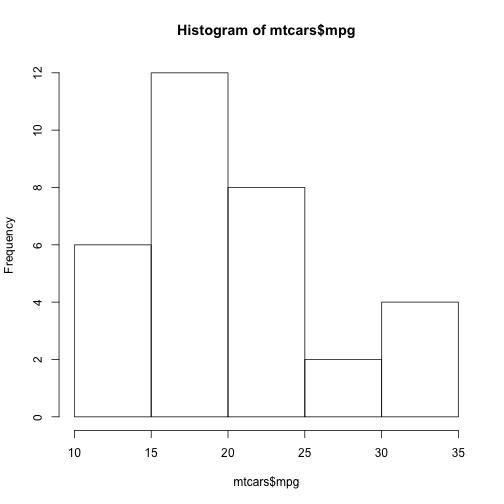

Pitch for my Shiny App
========================================================
author: Nishant Sahni
date: 2/20/2016


URL for my Shiny app
========================================================

- https://niceguy.shinyapps.io/courserashiny/
- Explore the Motor trends data online and interactively
- Is an automatic or manual transmission better for MPG.
- Quantify the MPG difference between automatic and manual transmissions

---

Explore the data
========================================================
- Analyse the data with customisable linear regression


```r
model <- lm(mpg~cyl,data=mtcars)
summary(model)
```

```

Call:
lm(formula = mpg ~ cyl, data = mtcars)

Residuals:
    Min      1Q  Median      3Q     Max 
-4.9814 -2.1185  0.2217  1.0717  7.5186 

Coefficients:
            Estimate Std. Error t value Pr(>|t|)    
(Intercept)  37.8846     2.0738   18.27  < 2e-16 ***
cyl          -2.8758     0.3224   -8.92 6.11e-10 ***
---
Signif. codes:  0 '***' 0.001 '**' 0.01 '*' 0.05 '.' 0.1 ' ' 1

Residual standard error: 3.206 on 30 degrees of freedom
Multiple R-squared:  0.7262,	Adjusted R-squared:  0.7171 
F-statistic: 79.56 on 1 and 30 DF,  p-value: 6.113e-10
```

---

Plot the data and see the source code
========================================================


```r
hist(mtcars$mpg)
```


- Use Shiny controls to play with the plotting parameters
- The source code can be found  at
https://github.com/manisahni/courserashiny.git

---
